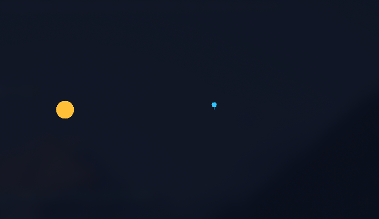
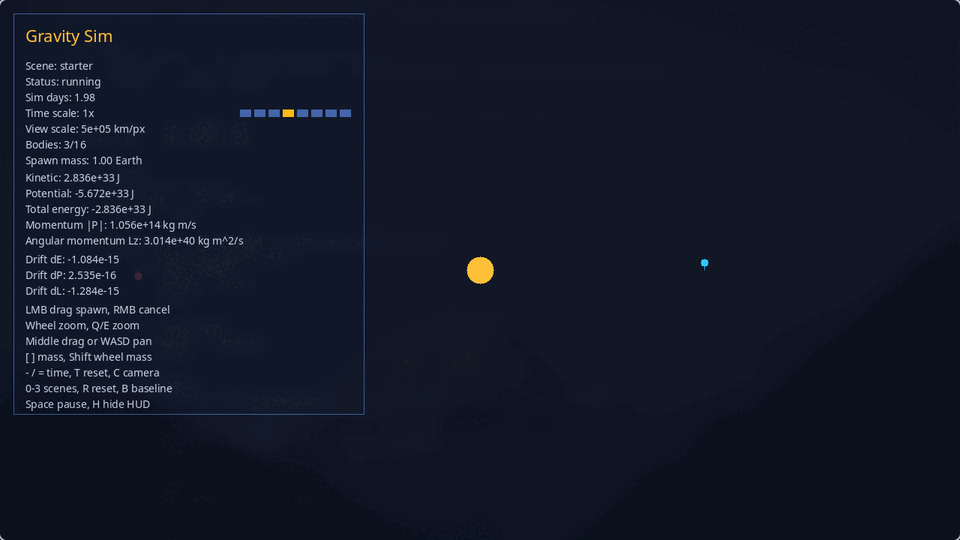

# GravitySim


GravitySim is a real time 2D gravity simulation written in C with SDL2. It started as a fun curiosity project, but my motivation for continuing sort of changed, it was like agame before but now I'm aiming to keep the interaction side as enjoyable as possible while still pushing the actual simulation toward more defensible physics and better numerical behaviour. 

The current build already supports physically meaningful units, velocity Verlet integration, preset scenes, interactive spawning, collision merging, camera controls, and live diagnostics for energy, momentum, angular momentum, and drift. I'm still actively working on it but the foundation is pretty solid and I have a laid out roadmap going forward.

## Preview

<p align="center">
  
  
</p>

<p align="center">
  
</p>

## Current Feature Set

- It has real time N body gravity simulation in C
- SDL2 rendering with trails, HUD, and camera controls
- Physically meaningful simulation units
- Velocity Verlet integration for better orbital stability
- Interactive body spawning with a drag based launch velocity
- Preset scenes for empty space, a starter system, three body problem, and binary stars
- Perfectly inelastic collision merging with mass, momentum, and density aware radius updates
- Also implemented diagnostics for total energy, total momentum, angular momentum, and relative drift from a your chosen baseline

## Core Physics Concepts

The sim uses Newtonian gravity. Each body feels the sum of gravitational acceleration from every other body modelled by:

`a_i = Σ G m_j (r_j - r_i) / |r_j - r_i|^3`

At the moment, the simulation uses velocity Verlet integration, which is a much better fit for orbital systems than a simple Euler step. It's still lightweight enough for real time use, but it behaves better over longer runs. 

Collisions are handled as perfectly inelastic merges. Mass and linear momentum are conserved, merged radius is recomputed from mass and density, and off centre impacts keep angular momentum bookkeeping through a stored spin term.

There is also a drift system in the HUD. Implemented during debugging but kept it since I felt if I was asking myself: “does this look right?”, other people might too. It measures how far the current state has numerically moved away from a chosen baseline, which makes it easier to judge integrator quality and general simulation health.

More informal write-ups live in [Theory notes/Notes.md](Theory%20notes/Notes.md).

## Build

### Dependencies

- C compiler with C11 support
- `SDL2`
- `SDL2_ttf`
- `make`
- `pkg-config`

### Build And Run

```bash
make
make run
```

### Arch Linux

```bash
sudo pacman -S sdl2 sdl2_ttf pkgconf
make
make run
```

My main develpment environment is Arch Linux, but the code is meant to stay portable anywhere SDL2 and SDL2_ttf are available.

## Controls

- `LMB drag`: spawn a body and set its initial velocity
- `RMB`: cancel spawn
- `Shift + mouse wheel` or `[ ]`: change spawn mass
- `Mouse wheel` or `Q / E`: zoom
- `Middle mouse drag` or `W A S D` / arrow keys: pan camera
- `C`: reset camera
- `- / =`: slow down or speed up simulated time
- `T`: reset time scale
- `0 / 1 / 2 / 3`: switch scenes
- `R`: reset the current scene
- `B`: reset the diagnostics baseline
- `Space`: pause
- `H`: hide the HUD
- `Esc`: quit

## Roadmap

The badge above is generated automatically from this checklist by a GitHub Action.

### Completed

- [x] SDL2 window, renderer, and timestep-based simulation loop
- [x] Multiple gravitating bodies with mass, position, and velocity
- [x] Trail rendering
- [x] Pause and reset controls
- [x] Interactive body spawning
- [x] Preset scenes
- [x] Codebase split into modules
- [x] Move from sandbox-style units to physically meaningful units
- [x] Velocity Verlet integration
- [x] Time scaling controls
- [x] In-window HUD
- [x] Camera zoom and pan
- [x] Diagnostics for energy, momentum, and angular momentum
- [x] Drift tracking from a resettable baseline
- [x] Collision detection with perfectly inelastic merging
- [x] Spin bookkeeping during off-centre merges
- [x] SDL_ttf HUD cleanup

### Planned

- [ ] Save and load simulation states
- [ ] Integrator comparison mode
- [ ] Better density and body-type models
- [ ] More physically defined preset scenes
- [ ] Barnes-Hut approximation for larger body counts
- [ ] Collision model extensions beyond simple merging
- [ ] Black hole / extreme gravity experiment mode
- [ ] Data export and benchmarking tools
- [ ] General polish for public releases
